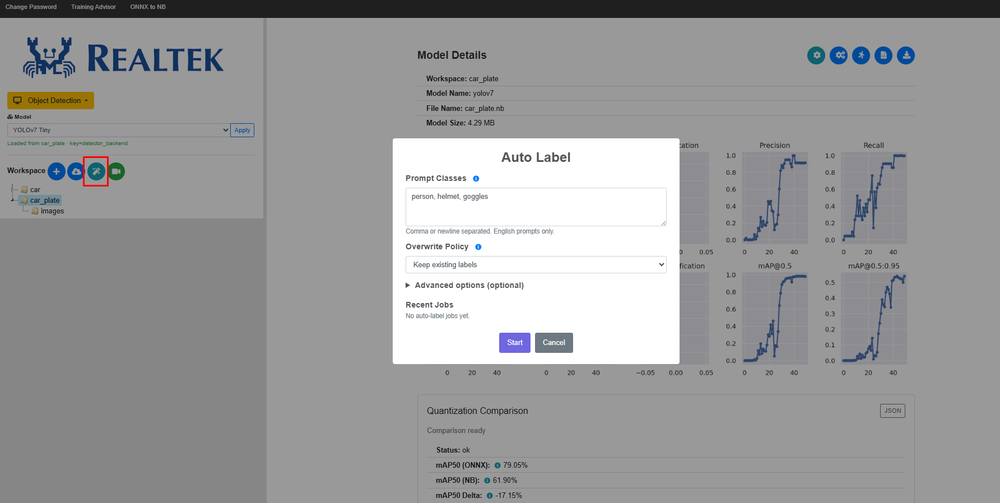
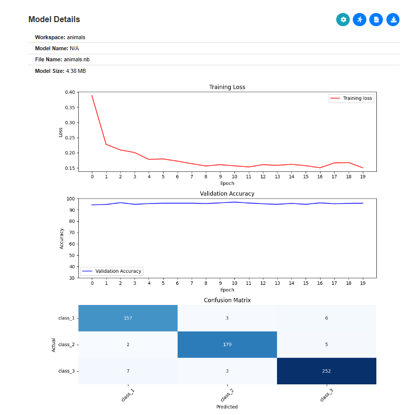
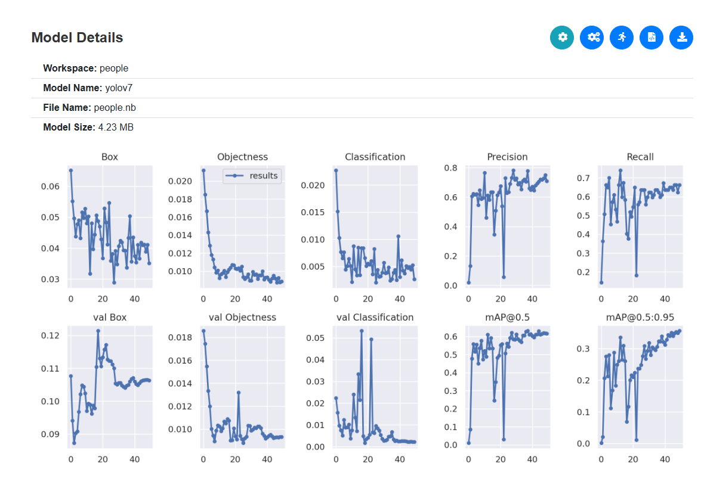
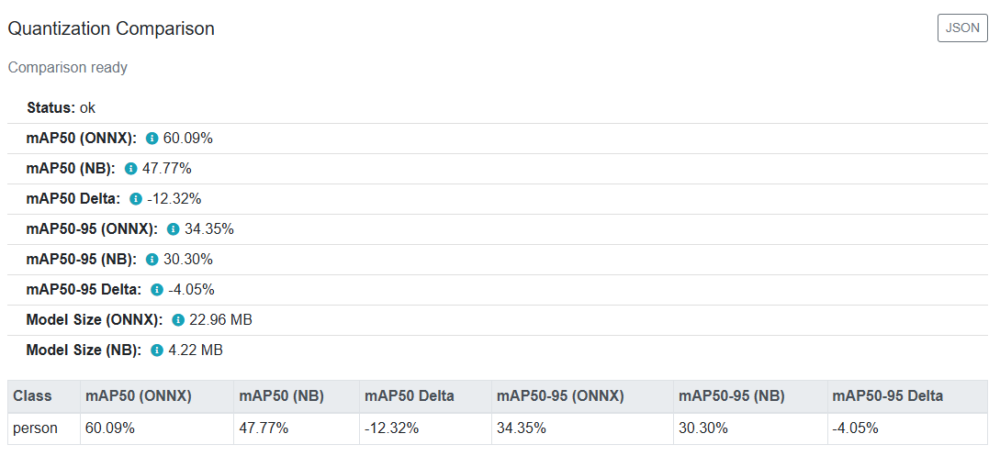
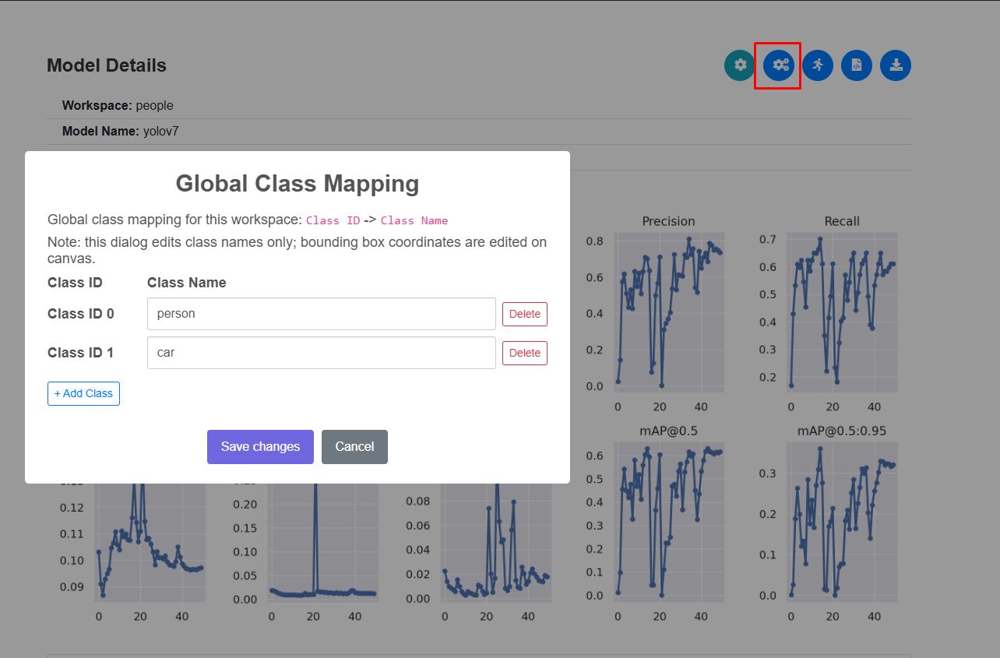
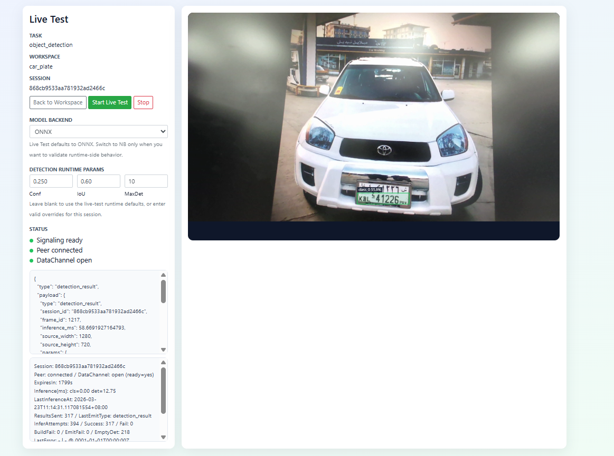

AI Training Server Setup
==========================

.. Note::
   To set up, it requires executing several commands. The process has been packaged into Docker, so you only need to import the Docker image to get started.

1. Hardware Requirements
-------------------------

- Ubuntu OS system with nvidia gpu (recommend version: ubuntu-24.04)

- 32GB DRAM

- Nvidia 4060 8GB VRAM (or above)

.. Note::
   The AI Training Server does not support installation or execution on WSL (Windows Subsystem for Linux). A native Ubuntu environment with NVIDIA GPU support is required.

2. Nvidia Driver Installation
------------------------------

* Open Software & Updates
* Navigate to the Additional Drivers tab
* Select the driver labeled "proprietary, tested" (e.g., nvidia-driver-560)
* Click Apply Changes and reboot
* After rebooting, verify the installation by running nvidia-smi

.. figure:: ../../_static/user_manual/AI_train_server/ai_train_server_setup_2_1.png
   :align: center

|

3. Docker Installation
-----------------------

* Please follow the instructions from: https://docs.docker.com/engine/install/ubuntu/
* Add user into docker group and reboot

.. code-block:: bash

   sudo usermod -aG docker $USER

* Use docker ps to verify the installation

4. Create Working Directory
----------------------------

Create a folder to put the scripts and tar.gz files inside (ex. AI_train_server), the folder structure will be similar as follow

.. code-block:: bash

   AI_train_server/
   |-- docker_images/
   |   |-- IMAGES.txt --> docker images list
   |   |-- load_docker_images.sh  --> installation scripts
   |   |-- acuity_converter_v1.1.tar.gz  --> docker image file
   |   |-- training-server-train_latest.tar.gz  --> docker image file
   |   |-- training-server-importer_latest.tar.gz  --> docker image file
   |   |-- nvidia_cuda_12.1.1-cudnn8-runtime-ubuntu22.04.tar.gz  --> docker image file
   |-- base
   |-- base-20260109-165208.tar.gz
   |-- workspaces_example
   |-- workspaces-example-20251223-135111.tar.gz
   |-- INSTALLATION.md

5. Install the scripts
-----------------------

.. code-block:: bash

   tar -xzf base-<timestamp>.tar.gz
   tar -xzf workspaces-example-<timestamp>.tar.gz
   cd docker_images && ./load_docker_images.sh
   cd ../base
   sudo ./install.sh
   cd ../workspaces_example && ./install_workspaces_example.sh (optional, generate default example)

6. Login to the System
------------------------

After installation, there will an shortcut on the desktop, or you can login by "http://localhost:8080/login".

.. figure:: ../../_static/user_manual/AI_train_server/ai_train_server_setup_6_1.jpg
   :align: center

   System login interface

On the model training interface, log in with the default username “admin@realtek.com” and password "admin123” After logging in, you can change the password if you want.

The system supports multiple user accounts, with each account having its own workspace. However, only one training job can run at a time due to the limitation of a single NVIDIA GPU.

AI Training Server Run
=========================

The AI Training Server supports a complete workflow, from managing your own data, to simulation testing, and finally to on-device testing.

1. Log into the Server
------------------------

Ensure you have access to the server and log in with the appropriate credentials.

2. Start the Training
------------------------

Once you have successfully logged into the server, you can upload your own dataset or download the example datasets from hugging face, user can also adjust the training configuration.

.. figure:: ../../_static/user_manual/AI_train_server/ai_train_server_run_2.png
   :align: center

   Importing dataset

Labels for the dataset can be generated automatically.

   Auto labelling

Image classification can displays the loss, object detection shows the training progress.

   Image classification display loss

   Object detection display training progress

The tool provides a before-and-after comparison of the model during quantization (FP32 to INT8). You can also download the trained ONNX and NB files for further manual comparison if needed.

   Quantization Comparison

You can define and manage classes directly in the UI. To recognize new objects, simply add a new class, and the system will automatically include it in the training process.

   Add new class

.. Note::
      Theoretically, because the initial starting weights are random, it is highly unlikely for the model to converge to the exact same result. However, if you increase the number of epochs and run the training multiple times, the difference between the results will be very small. The final accuracy depends heavily on the epochs and the initial starting point. Because of this, in practice, training is not done just once.

3. Download the Model
------------------------

When the training is completed, a download button will appear. Click this button to download the trained model, which you can use on AmebaPro2.

.. figure:: ../../_static/user_manual/AI_train_server/ai_train_server_run_3.png
   :align: center

   'Run' and 'Download Model' button

.. Note::
      Currently, Hugging Face integration is mainly intended for initial testing. Uploading locally trained models for quantization and deployment is not yet supported, but this feature is planned for future development.

4. Model Testing
------------------
   
After the training is complete, the current tool features a built-in simulator that allows you to directly observe the results and helps you evaluate the model.

   Live test