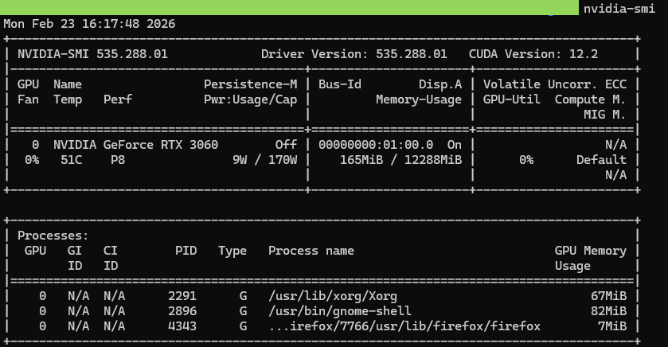
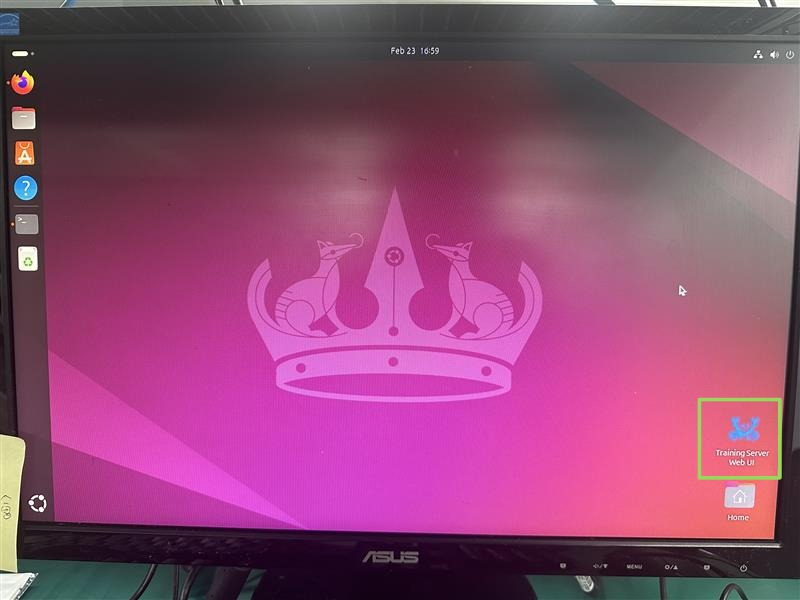
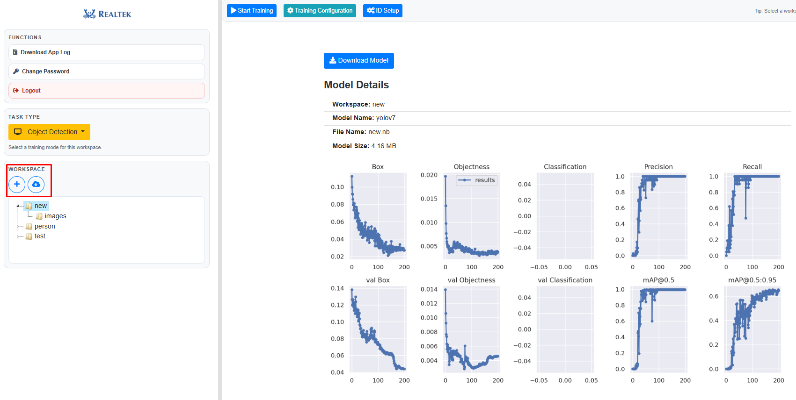
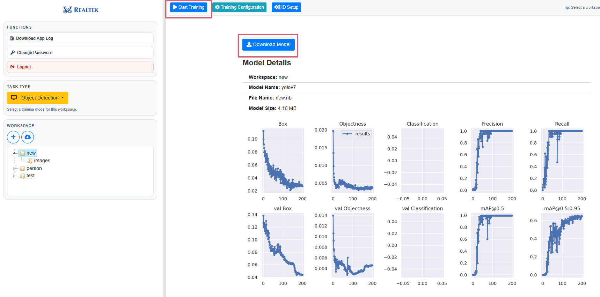

**AI Training Server Setup**
=============================

1. Hardware Requirements
-------------------------

- Ubuntu OS system with nvidia gpu (recommend version: ubuntu-24.04)

- 32GB DRAM

- Nvidia 4060 8GB VRAM (or above)

2. Nvidia Driver Installation
------------------------------

* Open Software & Updates
* Navigate to the Additional Drivers tab
* Select the driver labeled "proprietary, tested" (e.g., nvidia-driver-560)
* Click Apply Changes and reboot
* After rebooting, verify the installation by running nvidia-smi

|

3. Docker Installation
-----------------------

* Please follow the instructions from: https://docs.docker.com/engine/install/ubuntu/
* Add user into docker group and reboot

.. code-block:: bash

   sudo usermod -aG docker $USER

* Use docker ps to verify the installation

4. Create Working Directory
----------------------------

Create a folder to put the scripts and tar.gz files inside (ex. AI_train_server), the folder structure will be similar as follow

.. code-block:: bash

   AI_train_server/
   |-- docker_images/
   |   |-- IMAGES.txt --> docker images list
   |   |-- load_docker_images.sh  --> installation scripts
   |   |-- acuity_converter_v1.1.tar.gz  --> docker image file
   |   |-- training-server-train_latest.tar.gz  --> docker image file
   |   |-- training-server-importer_latest.tar.gz  --> docker image file
   |   |-- nvidia_cuda_12.1.1-cudnn8-runtime-ubuntu22.04.tar.gz  --> docker image file
   |-- base
   |-- base-20260109-165208.tar.gz
   |-- workspaces_example
   |-- workspaces-example-20251223-135111.tar.gz
   |-- INSTALLATION.md

5. Install the scripts
-----------------------

.. code-block:: bash

   tar -xzf base-<timestamp>.tar.gz
   tar -xzf workspaces-example-<timestamp>.tar.gz
   cd docker_images && ./load_docker_images.sh
   cd ../base
   sudo ./install.sh
   cd ../workspaces_example && ./install_workspaces_example.sh (optional, generate default example)

6. Login to the System
------------------------

After installation, there will an shortcut on the desktop, or you can login by "http://localhost:8080/login".

   System login interface

On the model training interface, log in with the default username “admin@realtek.com” and password "admin123” After logging in, you can change the password if you want.

**AI Training Server Run**
===========================

1. **Log into the Server**

   Ensure you have access to the server and log in with the appropriate credentials.

2. **Start the Training**

   Once you have successfully logged into the server, you can upload your own dataset or download the example datasets from hugging face, user can also adjust the training configuration.

   Importing dataset

3. **Download the Model**

   When the training is completed, a download button will appear. Click this button to download the trained model, which you can use on AmebaPro2.

   'Run' and 'Download Model' button

**AI Training Server Q & A**
============================

**1. Is setting up AI Training Server a one-click installation?**

.. Tip::
   No, it requires executing several commands. However, the complex installation process has been packaged into Docker. You simply need to import the Docker image to get started.

**2. Can the AI Training Server supports the full workflow from data management to on-device testing?**

.. Tip::
   Yes, the current architecture supports the complete workflow: from managing your own data, to simulation testing, to on-device testing.

**3. Can data annotation and dataset splitting be performed automatically?**

.. Tip::
   - No, it cannot automatically generate annotations. Manual labeling is required, either using external annotation tools or the server's built-in annotation tool.
   
   - However, dataset splitting is performed automatically. 

**4. Besides importing from Hugging Face, does AI Training Server support uploading locally trained models for quantization and deployment?**

.. Tip::
   Currently, Hugging Face integration is mainly provided for initial testing purposes. Local model upload is not yet supported, but this feature is planned for future development.

**5. Does AI Training Server provide detailed quantization accuracy loss reports?**
   
.. Tip::
   Currently, it does not provide quantization accuracy loss reports. However, this feature is under development and will be available in a future update.

**6. Can we use APIs to access the underlying training and conversion tools for domain-specific data augmentation and training?**

.. Tip::
   Yes, this is possible. You can use the command-line tools to access these functionalities. While they are less user-friendly than the UI tools, they provide greater flexibility and allow more parameter customization.

**7. How do AI Training Server learn to recognize new things?**

.. Tip::
   You can simply add a new class directly in the UI, and the tool will automatically add the item.

**8. If we run two training sessions using the exact same dataset, will we get the exact same accuracy? If not, how much will it vary?**

.. Tip::
   Theoretically, because the initial starting weights are random, it is highly unlikely for the model to converge to the exact same result. However, if you increase the number of epochs and run the training multiple times, the difference between the results will be very small. The final accuracy depends heavily on the epochs and the initial starting point. Because of this, in practice, training is not done just once.

**9. When a model encounters an error or behaves abnormally, what information does the Realtek EdgeAI Tools provide to assist with troubleshooting, besides log files?**

.. Tip::
   After the training is complete, the current tool features a built-in simulator that allows you to directly observe the results and helps you evaluate the model.

**10. Does AI Training Server support model version control and rollback features?**

.. Tip::
   Currently, this management feature is not supported. Users need to manually download and keep a record of the models.

**11. During the training process, are the three curves for accuracy, precision, and recall displayed simultaneously?**

.. Tip::
   In the current tool, image classification displays the loss, object detection only shows the training progress.

**12. Does the tool provide a before-and-after comparison after model quantization (FP32 to INT8)?**

.. Tip::
    Yes, a before-and-after comparison is provided. Additionally, you can download the trained ONNX and NB files to perform a manual comparison.

**13. How is model accuracy maintained when dealing with highly imbalanced datasets?**

.. Tip::
   Regarding dataset bias, the system currently calls an external LLM model to provide suggestions and warnings for the training process.

**14. Does the tool support installation and running on WSL in Windows?**

.. Tip::
   The Training Server does not support installation on WSL.

**15. Do we need to provide our own dataset? If so, do you have any recommendations?**

.. Tip::
   - You can source your own data.
   - The default demo dataset can be downloaded from Hugging Face (provided you have an active internet connection).

**16. Does the server side of the tool support multi-account? If so, what specific features or permissions can be managed?**

.. Tip::
   Yes, it supports multi-account, allowing each account to have its own workspace. However, only one training job can run at a time since there is only a single NVIDIA GPU available.

**17. Besides running .nb models generated by AI Training Server, can the EVB run .nb models generated by other tools?**

.. Tip::
   The model must be quantized and converted into a hardware-compatible .nb file using Realtek tools. But in the earlier stages (before generating the ONNX file), customers can use the tools they are accustomed to.

**18. I would like to test the video capture performance under different data formats, resolutions, and frame rates, as well as the audio capture performance under different sampling rates. Although these parameters can be modified in the demo code, how can I verify that my settings have been successfully applied?**

.. Tip::
   You can check the current video stream information in VLC by going to Tools → Media Information → Codec. The default information includes the format (e.g., H.264), resolution (e.g., 1920×1080), and frame rate (e.g., 30 fps).